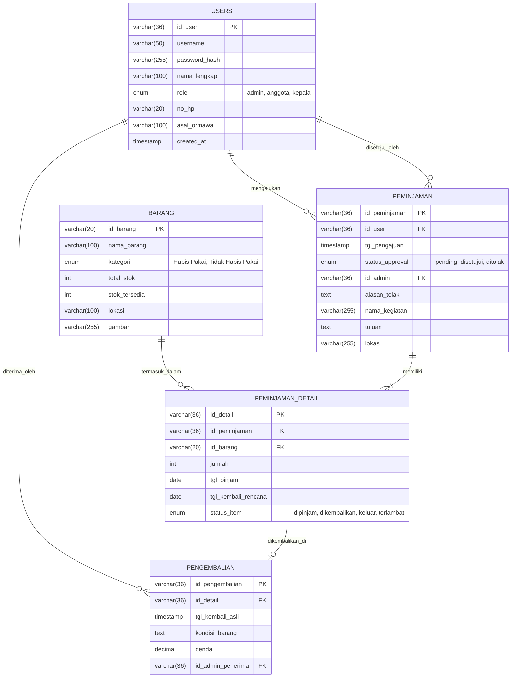

# Sistem Informasi Inventaris dan Peminjaman Barang (SI-IPB)

[](https://www.php.net/)
[](https://www.mysql.com/)
[](LICENSE)

SI-IPB adalah aplikasi berbasis web yang dirancang khusus untuk mempermudah pengelolaan inventaris dan alur peminjaman barang di lingkungan organisasi (seperti Organisasi Mahasiswa/Ormawa, sekolah, atau kantor). Aplikasi ini dibangun menggunakan **PHP Native dengan koneksi database PDO** yang aman, serta antarmuka modern yang dikembangkan dengan CSS murni (modern minimalist design system) dan interaksi dinamis menggunakan JavaScript.

---

## 🌟 Fitur Utama

Aplikasi ini mendukung **Multi-Role User** dengan hak akses yang terbagi menjadi tiga tingkatan:

### 1. Anggota (Peminjam)
*   **Registrasi & Profil Mandiri**: Pendaftaran akun anggota secara mandiri dengan data asal organisasi (Ormawa).
*   **Pengajuan Peminjaman**: Mengajukan permohonan peminjaman barang untuk berbagai kegiatan secara terjadwal dengan memilih lokasi, nama kegiatan, dan tujuan.
*   **Detail Item Peminjaman**: Dapat meminjam beberapa barang sekaligus dalam satu kali pengajuan (multi-item booking).
*   **Chatbot Assistant**: Fitur bantuan berbasis chatbot interaktif untuk panduan operasional sistem dan informasi inventaris secara cepat.
*   **Riwayat Peminjaman**: Melacak status pengajuan (Pending, Disetujui, atau Ditolak) secara real-time.

### 2. Admin (Logistik & Inventaris)
*   **Manajemen Inventaris**: Menambah, memperbarui, dan menghapus data barang (termasuk upload gambar barang, penentuan lokasi penyimpanan, dan kategori barang habis/tidak habis pakai).
*   **Persetujuan Peminjaman**: Memeriksa pengajuan masuk, menyetujui, atau menolak peminjaman disertai alasan penolakan yang jelas.
*   **Manajemen Pengembalian**: Memproses pengembalian barang, mencatat kondisi fisik barang saat kembali (baik/rusak), serta menghitung denda otomatis jika terjadi keterlambatan atau pelanggaran.
*   **Kontrol Stok Otomatis**: Stok barang secara otomatis berkurang saat disetujui untuk dipinjam, dan bertambah kembali setelah barang dinyatakan kembali.

### 3. Kepala (Pimpinan Organisasi)
*   **Dashboard Executive**: Memantau statistik total inventaris, status barang yang sedang dipinjam, dan riwayat transaksi.
*   **Laporan Peminjaman**: Mengunduh dan meninjau laporan perputaran barang untuk kebutuhan arsip dan evaluasi berkala.

---

## 🛠️ Teknologi yang Digunakan

*   **Backend**: PHP (Pemrograman Terstruktur dengan PDO Extension untuk keamanan query SQL Injection).
*   **Frontend**: HTML5, Vanilla JavaScript (ES6), dan Custom CSS3 (Modern Minimalist Design System, menggunakan font *Manrope* dan tema warna *Emerald Green*).
*   **Database**: MySQL / MariaDB.
*   **Koneksi Database**: PDO (PHP Data Objects).

---

## 🗄️ Struktur Database

Relasi antar tabel dalam database `inventaris_peminjaman` dapat dilihat pada diagram berikut:



---

## 📂 Struktur Folder Proyek

```text
├── .vscode/               # Konfigurasi editor VSCode
├── admin/                 # Modul dashboard dan fitur untuk role Admin
├── anggota/               # Modul dashboard dan fitur untuk role Anggota (Peminjam)
├── kepala/                # Modul dashboard dan fitur untuk pimpinan
├── assets/                # Aset gambar, stylesheet tambahan, dan ikon
│   └── images/            # Folder penyimpanan foto barang/profil
├── alter_peminjaman.php   # Script modifikasi tabel peminjaman
├── chatbot.js             # Logika interaktif Chatbot Asisten
├── index.html             # Landing page / Halaman selamat datang utama
├── inventaris_peminjaman.sql # File database dump MySQL
├── koneksi.php            # Koneksi database menggunakan PDO
├── login.php              # Halaman autentikasi masuk sistem
├── logout.php             # Halaman keluar dari sistem
├── register.php           # Halaman pendaftaran akun anggota baru
├── script.js              # Custom JavaScript untuk interaksi UI frontend
└── style.css              # Custom styling stylesheet utama (Design System)
```

---

## 🚀 Panduan Instalasi Lokal

### 1. Prasyarat
Pastikan Anda sudah menginstal web server lokal berikut:
*   [XAMPP](https://www.apachefriends.org/) (Rekomendasi PHP 8.2 atau lebih tinggi) atau [Laragon](https://laragon.org/).
*   Browser Modern (Chrome, Edge, Firefox, dll.).

### 2. Kloning Repositori
Kloning repositori ini ke dalam direktori web server Anda (`htdocs` jika menggunakan XAMPP):
```bash
git clone https://github.com/KrisArdani/inventaris_peminjaman.git
```
Atau ekstrak file zip proyek ke dalam folder `C:\xampp\htdocs\inventaris_peminjaman`.

### 3. Import Database
1.  Jalankan modul **Apache** dan **MySQL** pada XAMPP Control Panel.
2.  Buka browser dan akses halaman **phpMyAdmin** (`http://localhost/phpmyadmin`).
3.  Buat database baru dengan nama `inventaris_peminjaman`.
4.  Pilih database tersebut, masuk ke tab **Import**, pilih file `inventaris_peminjaman.sql` yang ada di root direktori proyek ini, lalu klik **Go** atau **Import**.

### 4. Konfigurasi Koneksi Database
Buka file `koneksi.php` menggunakan editor kode Anda dan sesuaikan konfigurasi database jika diperlukan:
```php
$host = "localhost:3306";
$user = "root";
$pass = ""; // kosongkan jika menggunakan setelan default XAMPP
$db   = "inventaris_peminjaman";
```

### 5. Jalankan Aplikasi
Akses aplikasi melalui browser dengan URL:
```text
http://localhost/inventaris_peminjaman
```

### 🔑 Akun Uji Coba Default
Anda dapat masuk menggunakan salah satu akun di bawah ini:

| Role | Username | Password | Deskripsi |
| :--- | :--- | :--- | :--- |
| **Admin** | `admin` | `admin` | Akses penuh manajemen inventaris & persetujuan |
| **Kepala** | `kepala` | `admin` | Akses laporan dan monitoring pimpinan |
| **Anggota** | `anggota` | `admin` | Akses pengajuan peminjaman barang |

---

## 📄 Lisensi
Proyek ini dilindungi di bawah lisensi MIT. Lihat file `LICENSE` untuk informasi lebih lanjut.
